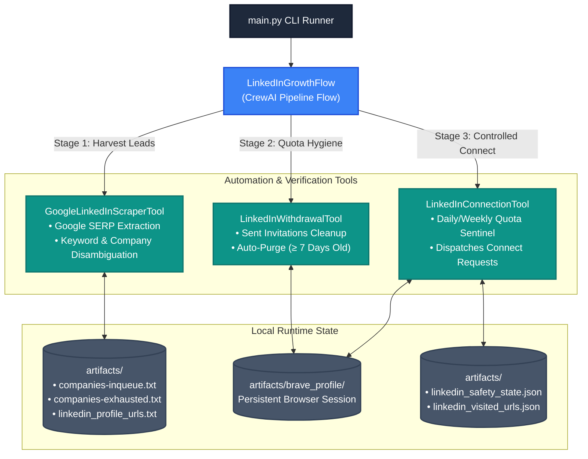

# LinkedIn Growth Core

[](https://www.python.org/downloads/)
[](https://playwright.dev/)
[](https://crewai.com)
[](LICENSE)
[](https://github.com/psf/black)

An autonomous outbound network expansion engine combining **CrewAI** and **Playwright**. The engine extracts engineering profiles via search engine indexing, cleans stale pending invitations, and executes rate-limited, safety-gated connection requests using persistent browser sessions.

---

## Table of Contents

- [Architecture Overview](#architecture-overview)
- [The Three-Stage Autonomous Growth Loop](#the-three-stage-autonomous-growth-loop)
- [Directory Structure](#directory-structure)
- [Getting Started](#getting-started)
  - [Prerequisites](#prerequisites)
  - [Installation](#installation)
  - [Environment Configuration](#environment-configuration)
  - [Persistent Browser Session Setup](#persistent-browser-session-setup)
- [Running the Engine](#running-the-engine)
- [Safety & Rate Limiting Guarantees](#safety--rate-limiting-guarantees)
- [Troubleshooting & Diagnostics](#troubleshooting--diagnostics)
- [License](#license)

---

## Architecture Overview



---

## The Three-Stage Autonomous Growth Loop

1. **Lead Sourcing (`GoogleLinkedInScraperTool`)**:

- Evaluates available targets from `artifacts/companies-inqueue.txt`.
- Queries search engines for indexable public LinkedIn profile URLs matching configured role keywords.
- Disambiguates homonym companies and validates search depth.
- Moves exhausted companies out of queue and appends deduplicated profiles to `artifacts/linkedin_profile_urls.txt`.

2. **Invitation Hygiene (`LinkedInWithdrawalTool`)**:

- Navigates to LinkedIn's sent invitations manager.
- Scans pending invitations and auto-withdraws requests older than 7 days, maintaining a healthy invitation acceptance ratio.

3. **Rate-Limited Outreach (`LinkedInConnectionTool`)**:

- Inspects pending leads from the local queue.
- Enforces rolling safety windows (default: max 8 daily, max 50 weekly) strictly during configurable working hours (`09:00 - 19:00`).
- Sends connection requests via persistent session cookies without touching login APIs.

---

## Directory Structure

```text
linkedin-growth-core/
├── artifacts/
│   ├── companies-inqueue.txt.example  # Example target seed list
│   └── .gitkeep
├── config/
│   ├── __init__.py
│   ├── context.py                     # Execution path & environment resolver
│   └── settings.py                    # Pydantic Settings loader (TOML + .env)
├── flows/
│   ├── __init__.py
│   └── pipeline_flow.py               # Outbound orchestration pipeline
├── tools/
│   ├── __init__.py
│   ├── outreach_tool.py               # Connection dispatch & rate limiter
│   ├── scraper_tool.py                # SERP profile scraper & entity evaluator
│   └── withdrawal_tool.py             # Stale invitation cancellation manager
├── .env.example                       # API key template
├── .gitignore                         # Guards browser sessions & runtime logs
├── config.toml                        # Centralized operational parameters
├── LICENSE                            # MIT License
├── main.py                            # Primary execution entrypoint
├── README.md
└── requirements.txt

```

---

## Getting Started

### Prerequisites

- **Python**: 3.10 or higher.
- **Browser**: [Brave Browser](https://brave.com/?utm_source=gemini) (or Chromium / Google Chrome).
- **API Key**: An OpenAI API Key (or alternative LLM compatible with CrewAI).

### Installation

1. **Clone the repository**:

```bash
git clone [https://github.com/](https://github.com/)<your-username>/linkedin-growth-core.git
cd linkedin-growth-core

```

2. **Set up a virtual environment**:

```bash
python3 -m venv venv
source venv/bin/activate

```

3. **Install dependencies**:

```bash
pip install --upgrade pip
pip install -r requirements.txt
playwright install chromium

```

### Environment Configuration

1. **Set secrets**:

```bash
cp .env.example .env

```

Add your OpenAI API key in `.env`:

```env
OPENAI_API_KEY="sk-proj-yourKeyHere"

```

2. **Seed target companies**:

```bash
cp artifacts/companies-inqueue.txt.example artifacts/companies-inqueue.txt

```

Add the company names you wish to target (one per line). 3. **Configure operational parameters (`config.toml`)**:
Adjust rate limits, operating hours, and search keywords directly in `config.toml`:

```toml
[browser]
default_brave_path = "/Applications/Brave Browser.app/Contents/MacOS/Brave Browser"
flags = [
    "--disable-blink-features=AutomationControlled",
    "--no-default-browser-check",
    "--disable-infobars"
]

[growth.safety]
max_daily_requests = 8
max_weekly_requests = 50
operating_hour_start = 9
operating_hour_end = 19

[growth.scraping]
default_max_pages = 5
min_required_profiles = 10
default_withdrawal_batch = 20

[growth.queries]
role_keywords = '("Software Engineer" OR "SWE" OR "Backend" OR "Tech Lead")'

```

### Persistent Browser Session Setup

To execute headless automation without triggering authentication challenges or bot checkpoints, initialize your browser session once:

1. Launch Brave pointing to the designated project session directory:

```bash
"/Applications/Brave Browser.app/Contents/MacOS/Brave Browser" \
  --user-data-dir="artifacts/brave_profile"

```

2. Manually log into LinkedIn and complete any two-factor authentication (2FA) prompts.
3. Close the browser. All future automated runs will reuse these persistent authentication cookies.

---

## Running the Engine

Execute the end-to-end outbound pipeline:

```bash
python main.py

```

### CLI Arguments

You can pass optional arguments to target specific companies or limit outreach count:

```bash
# Target a specific company directly
python main.py --company "Stripe"

# Limit connection invitations sent in this run
python main.py --max-requests 5

```

### Example Run Output

```text
=================================================================
        LINKEDIN AUTONOMOUS OUTBOUND GROWTH ENGINE
=================================================================

[Stage 1] Selecting Target Company & Sourcing Leads...
-> Candidate chosen randomly: 'Stripe'. Evaluating search depth...
-> 'Stripe' passed validation with 14 profiles! Saving leads...
-> 'Stripe' moved from inqueue to exhausted queue.

[Stage 2] Running Stale Invitations Cleanup...
-> Checked 42 pending invitations. Withdrew 6 requests older than 7 days.

[Stage 3] Executing Targeted Outreach...
-> Connection sent to: [https://www.linkedin.com/in/jane-doe](https://www.linkedin.com/in/jane-doe) (1/8)
-> Connection sent to: [https://www.linkedin.com/in/john-smith](https://www.linkedin.com/in/john-smith) (2/8)

-----------------------------------------------------------------
                      RUN SUMMARY
-----------------------------------------------------------------
Target Company    : Stripe
Leads Harvested   : 14
Stale Withdrawn   : 6
Requests Sent     : 8
-----------------------------------------------------------------

```

---

## Safety & Rate Limiting Guarantees

- **No Plaintext Passwords**: Authentication is handled exclusively via persistent browser profiles; account credentials are never stored or passed in plaintext.
- **Operating Hours Enforcement**: The engine stops execution if triggered outside configurable business hours (`09:00 - 19:00` by default).
- **Rolling Quota Monitoring**: Tracks outreach activity in `artifacts/linkedin_safety_state.json` across a 7-day window to prevent spikes that trigger platform rate limits.
- **Event Loop Decoupling**: Browser automation and agent execution are isolated across threads to prevent hanging runtimes.

---

## Troubleshooting & Diagnostics

| Issue                            | Root Cause                                                                | Resolution                                                                                        |
| -------------------------------- | ------------------------------------------------------------------------- | ------------------------------------------------------------------------------------------------- |
| **`LinkedIn Authwall Detected`** | Expired session cookies or new security verification needed.              | Re-run the manual browser command pointing to `artifacts/brave_profile` and log in interactively. |
| **`Google Scraper Timeout`**     | Anti-bot interstitial or non-standard search markup.                      | Verify connectivity and check `artifacts/google_timeout_debug.png` for diagnostic screenshots.    |
| **`Outside Operating Hours`**    | Engine triggered outside `operating_hour_start` and `operating_hour_end`. | Update `[growth.safety]` in `config.toml` or execute within the configured time range.            |

---

## License

This project is licensed under the MIT License — see the [LICENSE](https://www.google.com/search?q=LICENSE&utm_source=gemini) file for details.

## Disclaimer & Terms of Use

This project is intended strictly for educational, research, and personal productivity purposes.

- **Independent Project**: This repository is not affiliated with, authorized, maintained, sponsored, or endorsed by LinkedIn Corporation or any of its affiliates.
- **Terms of Service**: Automating user actions or scraping data may violate the Terms of Service of target platforms. Use of this tool may result in account warnings, temporary restrictions, or permanent account termination.
- **User Responsibility**: The authors and contributors assume no liability and are not responsible for any misuse, account suspensions, data loss, or legal consequences resulting from the deployment of this software. Users run this software entirely at their own risk.
